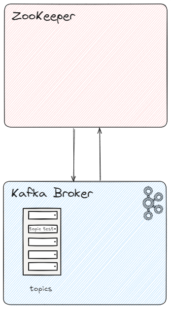

# Запуск Kafka + ZooKeeper
В данном уроке рассматривается запуск Kafka с ZooKeeper на локальном компьютере на Windows. Что будем использовать:

- **WSL** - WSL, или «Подсистема Windows для Linux», представляет собой встроенную функцию Windows 10, позволяющую запускать в Windows-среде консольные и графические приложения Linux.
- **Ubuntu Linux** - это операционная система для персональных компьютеров, которую можно использовать вместо Windows или Mac OS.
- **Java Development Kit** - бесплатно распространяемый корпорацией Oracle Corporation (ранее Sun Microsystems) комплект разработчика приложений на языке Java, включающий в себя компилятор Java (javac), стандартные библиотеки классов Java, примеры, документацию, различные утилиты и исполнительную систему Java (JRE).

### Данный урок включает себя три этапа:
1. Установка Kafka и просмотр файлов директории
1. Запуск Kafka + ZooKeeper
2. Тестирование Kafka+ZooKeeper
____
### 1. Установка Kafka и просмотр файлов директории
Создаваемый кластер будет состять из одного брокера(Kafka) и одного сервиса ZooKeeper. Схема взимодействия:


1. Заходим под root пользователем в Ubuntu

2. Установим Java Development Kit:
```bash
sudo apt update
sudo apt install openjdk-11-jdk 
```
3. Проверим версию Java:
```bash
java -version
```
Результат:
```bash
openjdk version "21.0.4" 2024-07-16                                    OpenJDK Runtime Environment (build 21.0.4+7-Ubuntu-1ubuntu224.04)                                           OpenJDK 64-Bit Server VM (build 21.0.4+7-Ubuntu-1ubuntu224.04, mixed mode, sharing)   
```

4. Переходим [на официальный сайт Apache Kafka](https://kafka.apache.org/downloads) и скачиваем последнюю версию Kafka.

5. Меняем название скаченной папки с файлами для запуска на `kafka` и опредеяем по пути `opt/kafka`

6. Детальнее посмотрим на содержимое папки:
```bash
#Переходим в папку kafka
cd /opt/kafka
#Просмотр содержимого папки kafka
ls
```
Результат:
```bash
LICENSE  
LICENSE:Zone.Identifier  
NOTICE  
NOTICE:Zone.Identifier  
bin  
config  
libs  
licenses  
logs  
site-docs  
```
7. Основные папки для запуска Kafka + ZooKeeper:

В папке `/opt/kafka/config` располагаются готовые файлы конфигурации брокера(Kafka) и сервиса(ZooKeeper)

В папке `opt/kafka/bin` располагаются готовые `.sh` файлы скриптов для использования в запуске брокера(Kafka) и сервиса(ZooKeeper)

8. Директория `/opt/kafka/config` хранит два необходимых файла конфигурации для запуска:
    - `zookeeper.properties` - config для ZooKeeper
    - `server.properties` - config для Kafka

9. Можно посмотреть на содержимое конфигов с помощью команд:
```bash
#Переходим в папку
cd /opt/kafka/config

#Посмотрим содержимое файла zookeeper.properties
cat zookeeper.properties

#Посмотрим содержимое файла service.properties
cat server.properties
```
### 1. Запуск Kafka + ZooKeeper
1. Запустим ZooKeeper в режиме daemon, находясь в директории `/opt/kafka`, используя утилиту `zookeeper-server-start.sh`:
```bash
bin/zookeeper-server-start.sh -daemon config/zookeeper.properties
```
2. Запустим Kafka в режиме daemon, находясь в директории `/opt/kafka`, используя утилиту `kafka-server-start.sh`:
```bash
bin/kafka-server-start.sh -daemon config/server.properties
```
3. **jps** — это утилита командной строки, которая предоставляет информацию о процессах Java Virtual Machine (JVM), текущих в системе. Проверим, запущенные сервисы с помощью утилиты `jps`:
```bash
jps
```
Результат:
```bash
3136 Kafka
3221 Jps                          
2342 QuorumPeerMain
```
- [x] Kafka запущена
- [x] ZooKeeper(QuorumPeerMain) запущен

4. Посмотрим список топиков, используя утилиту `kafka-topics.sh`:
```bash
bin/kafka-topics.sh --list --bootstrap-server localhost:9092
```
В результате получим пустой список, так как мы не создавали топики.

5. Создадим топик и назавем его `test`:
```bash
bin/kafka-topics.sh --create --topic test --bootstrap-server localhost:9092
```