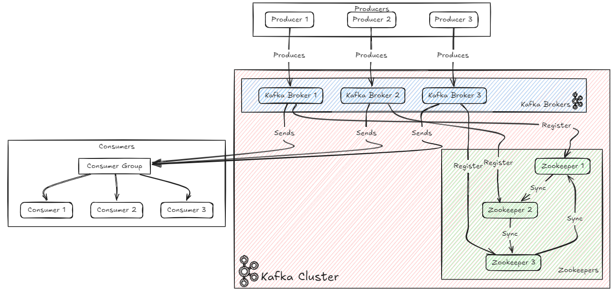

# Kafka Cluster
Рассмотрим создание кластера Kafka c ZooKeeper. Кластер будет состоять из трёх брокеров Kafka и трёх ZooKeeper сервисов, к которым будут подключаться продюсеры и консьюмеры.

 Примерная схема взаимодействия:
 

 Существует несколько вариантов разворачивания такого кластера:

 1. Запустить Kafka+ZooKeeper на трёх разных виртуальных машинах.
 2. Запустить локально на одной машине.

 Рассмотрим способ разворачивания кластера **на локальном компьютере**. Данный урок включает себя четыре этапа:
1. Создание директорий для развертывания кластера. Настройка файлов конфигурации.
2. Запустим 3 Kafka + ZooKeeper в пределах одного кластера
3. Проверим запущенные процессы и создания кластера
4. Запустим Kafka + ZooKeeper как сервис
___
### 1. Создание директорий для развертывания кластера. Настройка файлов конфигурации.

1. Переходим [на официальный сайт Apache Kafka](https://kafka.apache.org/downloads) и скачиваем последнюю версию Kafka

2. Создаём директорию `kafka` по пути `/opt` под пользователем root:
```bash
mkdir /opt/kafka
```
3. Делаем копии скаченной папки и меняем название папки с файлами для запуска на `kafka_server1`, `kafka_server2`, `kafka_server3` и опредеяем по пути `/opt/kafka`.

В результате содержимое `/opt` должно содержать три папки:
`kafka_server1`, 
`kafka_server2`, 
`kafka_server3`

4. Настроим свои настройки конфигурации Kafka и ZooKeeper. Переходим в `/opt/kafka/kafka_server1`:
```bash
cd /opt/kafka/kafka_server1
```

5. Переходим в режим редактирования файла `zookeeper.properties`:
```bash
nano config/zookeeper.properties
```

6. Редактируем параметры и сохраняем файл. Готовый файл с редактированными параметрами можно найти в репозитории `Lesson_2_Kafka_Cluster/Config_Settings/kafka_server1`

7. Переходим в режим редактирования файла `server.properties`:
```bash
nano config/server.properties
```

8. Редактируем параметры. Готовый файл с редактированными параметрами можно найти в репозитории `Lesson_2_Kafka_Cluster/Config_Settings/kafka_server1`

9. Пункты 4, 5, 6, 7, 8 повторить для `kafka_server2` `kafka_server3`

10. Для каждых редактированных конфигов проверить, применились ли изменения, посмотрев содержимое. Пример для `kafka_server1` и `zookeeper.properties`:
```bash
#Переходим в директорию
cd /opt/kafka/kafka_server1
# Посмотрим содержимое файла
cat config/zookeeper.properties
```
